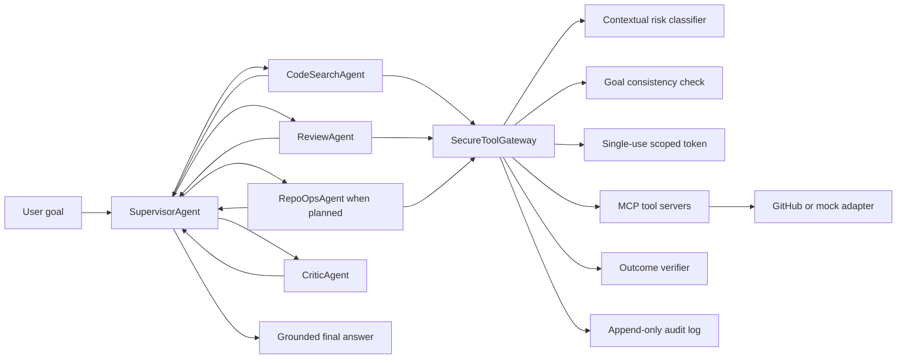

# Repo Guardian

## What it does

Repo Guardian is a locally runnable multi-agent pull-request assistant that delegates repository inspection, review writing, protected operations, and factual grounding to narrowly scoped agents. Every repository tool call crosses a secure gateway that classifies contextual risk, blocks Tier 3 operations, checks Tier 2 actions against the user's goal, issues a single-use scoped token, verifies state changes, and appends an immutable audit record. The mock GitHub adapter drives the default demo; setting `GITHUB_TOKEN` swaps in the real adapter without changing gateway or agent code. NVIDIA NIM powers agent reasoning through its OpenAI-compatible Chat Completions endpoint.

## Architecture diagram



## Running locally

```bash
uv sync
cp .env.example .env
uv run python -m repo_guardian.entrypoints.run_demo
```

The example configuration uses the offline demo client and mock GitHub adapter. Replace `NVIDIA_API_KEY=demo` with an NVIDIA API key to use `nvidia/nemotron-3-ultra-550b-a55b` through NVIDIA's hosted NIM endpoint. Repo Guardian enables streaming, reasoning, a 16,384-token reasoning budget, and a non-empty final response for coding-agent output. Set `GITHUB_TOKEN` to switch to the real GitHub adapter, `GITHUB_REPO=owner/repo` to select the repository, and `PR_NUMBER` to select the pull request. MCP HTTP endpoints can be started with `uv run python -m repo_guardian.entrypoints.serve_mcp`.

## Risk model

| fully closed | meaningfully reduced | open and documented |
|---|---|---|
| Tier 3 merge-to-main, force-push, protected-branch deletion, and unknown tools are blocked with no escalation path. | Tier 2 confused-deputy risk is reduced by a fast goal-consistency LLM check, scoped single-use credentials, outcome verification, and append-only auditing. | Goal consistency is a cheap partial mitigation, not a guarantee; model judgment and compromised external services remain possible. |

## What the demo produces

The terminal output lists each delegated subtask and agent, then every tool call with its tier and gateway decision. Read operations are approved automatically, the review comment is approved as Tier 2 and independently verified, and the PR description's request to merge to `main` produces an explicit Tier 3 `merge_pr` block. The output ends with the CriticAgent verdict, the grounded final answer, and every append-only audit event for the run.

## Known limitations

Real secrets management is out of scope: the token factory only simulates short-lived, tool-scoped credentials in memory. The mock adapter is not a real GitHub connection. The goal-consistency check only reduces confused-deputy risk. CriticAgent identifies claims that lack supporting tool results, but it does not guarantee that a supporting result or the resulting claim is factually correct.
