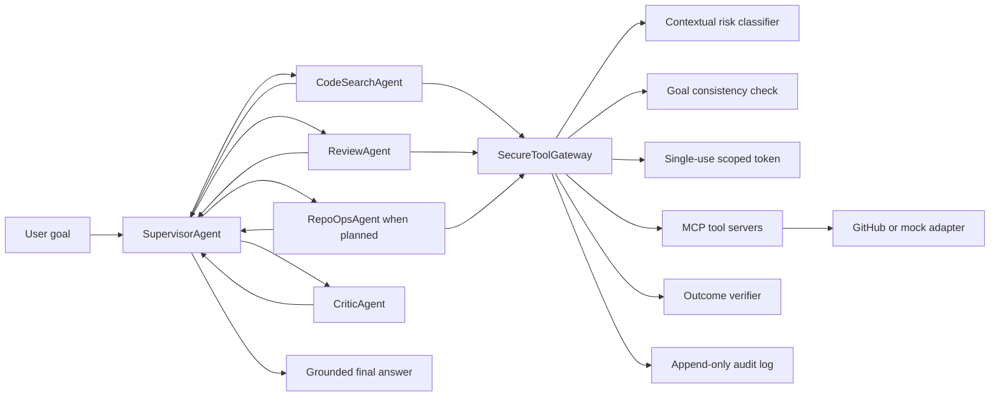

# Repo Guardian

A locally runnable, multi-agent pull-request assistant that delegates repository inspection, review writing, protected operations, and factual grounding to narrowly scoped agents. Every tool call crosses a **secure gateway** that classifies contextual risk, blocks the most dangerous operations, checks state-changing actions against your stated goal, issues a single-use scoped credential, verifies the outcome, and appends an immutable audit record.

---

## What Repo Guardian is

Repo Guardian is a defensive coding assistant built around a simple idea: LLM agents should be able to inspect code and draft reviews, but they should not be able to silently merge, force-push, or delete protected branches. A supervisor agent breaks your goal into subtasks, hands each subtask to a specialist agent, and routes every tool call through a security gateway before it reaches GitHub or a mock repository. A critic agent then checks that the final answer is actually grounded in the tool results.

It is designed to run on your laptop, use your own API keys, and keep all decision evidence in a local SQLite database.

---

## Why use this

| Capability | What you get |
|---|---|
| **Defense in depth** | Tier 3 actions (`merge_pr` to `main`, `force_push`, deletion of protected branches, unknown tools) are blocked outright with no escalation path. |
| **Confused-deputy reduction** | Tier 2 actions trigger a fast goal-consistency check so the gateway can refuse calls that drift from what you asked for. |
| **Scoped credentials** | Each approved tool call receives a single-use, time-bound, tool-scoped token instead of a long-lived API key. |
| **Outcome verification** | After a Tier 2 write, the gateway reads the state back and confirms the change happened. |
| **Immutable audit trail** | Every call, tier, decision, and outcome is stored in a local SQLite audit log. |
| **Factual grounding** | The CriticAgent rejects claims that are not supported by tool results, and the Supervisor revises once if grounding fails. |
| **Pluggable adapters** | The same agent and gateway code runs against the in-memory mock adapter or the real GitHub REST API. |
| **OpenAI-compatible LLM client** | Default reasoning uses NVIDIA NIM via its OpenAI-compatible Chat Completions endpoint; switching to OpenAI or another compatible provider is a configuration change. |

---

## What exists today

### Multi-agent pipeline

- **SupervisorAgent**: Plans the task graph, routes subtasks, publishes reviews, runs the critic, and revises once if the draft is not grounded.
- **CodeSearchAgent**: Gathers read-only evidence from the PR, diff, and commits and reports whether the change is safe to merge.
- **ReviewAgent**: Drafts a concise PR review comment from the evidence.
- **ReviewPublisher**: Wraps the draft in a `post_comment` tool call and executes it through the gateway.
- **RepoOpsAgent**: Executes explicitly planned repository operations; by default it demonstrates a `merge_pr` probe that the gateway blocks.
- **CriticAgent**: Compares the final answer against collected tool results and flags ungrounded claims.
- **BaseAgent**: Shared base class with LLM prompting, token-budget enforcement, and grounding rules injected into every system prompt.

### SecureToolGateway

The gateway is the single control point for every tool call. It coordinates:

- **ContextualRiskClassifier**: Maps tool names and parameters to Tier 1, Tier 2, or Tier 3.
- **GoalConsistencyChecker**: LLM-based yes/no check that a Tier 2 call aligns with the original user goal.
- **ScopedTokenFactory**: In-memory factory that issues single-use, tool-scoped, time-bound tokens.
- **OutcomeVerifier**: Reads back state after Tier 2 writes to confirm the change occurred.
- **SQLiteAuditLogger**: Append-only audit log in the local database.
- **MCPToolRouter**: Routes calls to the correct MCP server and rejects any call that lacks a valid gateway token.

### MCP tool servers

Three Model Context Protocol (MCP) servers run over FastAPI/uvicorn or in-process:

- **`/git`** — read-only tools: `get_file`, `search_code`, `get_pr`, `list_commits`, `get_diff`
- **`/review`** — write tools: `post_comment`, `add_label`
- **`/ops`** — dangerous tools: `merge_pr`, `force_push`, `delete_branch`

### Adapters

- **MockGitHubAdapter**: In-memory demo adapter with a fixed PR (#142) on branch `feature/auth-cleanup` → `main` and a simulated diff that removes a null-user guard.
- **GitHubAdapter**: Real GitHub REST API client using `urllib.request`. Activated automatically when `GITHUB_TOKEN` is set.

Both implement the same `GitHubAdapterPort` protocol, so no agent or gateway code changes when you swap adapters.

### Persistence

- **SQLiteTaskRepository**: Stores the task graph and subtask state.
- **SQLiteAuditLogger**: Stores every gateway decision.

### Configuration

`Config` uses Pydantic Settings and reads `.env`:

| Variable | Purpose | Default |
|---|---|---|
| `NVIDIA_API_KEY` | NVIDIA API key; empty/`demo` runs the offline demo client | `""` |
| `NVIDIA_BASE_URL` | NVIDIA NIM OpenAI-compatible endpoint | `https://integrate.api.nvidia.com/v1` |
| `GITHUB_TOKEN` | GitHub personal access token; if unset, the mock adapter is used | `""` |
| `GITHUB_REPO` | Target repository in `owner/repo` format | `owner/repo` |
| `PR_NUMBER` | Pull request to review | `142` |
| `MODEL` | Model name passed to the OpenAI-compatible client | `nvidia/nemotron-3-ultra-550b-a55b` |
| `MAX_ITERATIONS` | Maximum subtask iterations per run | `10` |
| `MAX_TOKENS_PER_RUN` | Token budget per run | `100000` |
| `WALL_CLOCK_TIMEOUT_SECONDS` | Wall-clock timeout | `120` |
| `COST_BUDGET_USD` | Cost budget in USD | `1.0` |
| `DB_PATH` | SQLite database path | `repo_guardian.db` |
| `ENABLE_GOAL_CONSISTENCY_CHECK` | Toggle goal-consistency check | `true` |

### Tests

`tests/` covers the security-critical parts:

- `test_classifier.py`: Tier 1/2/3 classification for every tool and edge case.
- `test_credential_manager.py`: Single-use tokens, expiration, and tool scoping.
- `test_critic.py`: Grounded and ungrounded claims, shared token budget.
- `test_gateway.py`: Tier 3 blocking, Tier 2 goal mismatch, Tier 1/Tier 2 approval, credential lifecycle, and direct MCP rejection without a token.
- `test_openai_client.py`: Streaming translation and usage extraction.

---

## What's new

Recent work on the project has focused on three areas:

1. **OpenAI-compatible LLM layer** — The client now speaks the OpenAI Chat Completions protocol, with NVIDIA NIM as the default provider. This makes it easy to switch providers by changing the base URL and model name.

2. **NVIDIA Nemotron 3 Ultra reasoning** — The default model is now `nvidia/nemotron-3-ultra-550b-a55b`, configured with streaming, reasoning, a 16,384-token reasoning budget, and a non-empty final response for coding-agent output.

3. **Real GitHub integration** — The gateway and agents now run unchanged against either the in-memory mock adapter or the live GitHub REST API. Setting `GITHUB_TOKEN` is the only switch required.

The repository also includes a standalone `repo-guardian-mcp` entry point that starts the three MCP tool servers as HTTP endpoints.

---

## Architecture

### Component overview



### How a tool call flows through the gateway

1. The agent builds a `ToolCall` and passes it to `SecureToolGateway.execute(...)`.
2. The classifier assigns a risk tier based on the tool name and parameters.
3. A pending audit entry is written.
4. **Tier 3**: blocked immediately with no retry or escalation.
5. **Tier 2**: a goal-consistency check runs against the original task graph; if it fails, the call is blocked.
6. A single-use, tool-scoped token is issued by the credential manager.
7. The gateway routes the call to the appropriate MCP server, which validates the token before invoking the adapter.
8. After the call, the token is revoked.
9. For Tier 2 writes, the outcome verifier reads the state back to confirm success.
10. A final audit entry records the decision and outcome.

### Risk tiers

| Tier | Tools | Treatment |
|---|---|---|
| **Tier 1** | `get_file`, `search_code`, `get_pr`, `list_commits`, `get_diff` | Approved automatically; logged. |
| **Tier 2** | `post_comment`, `add_label`, `create_draft`; `merge_pr` to non-protected base; `delete_branch` for non-protected branch | Goal-consistency check + single-use scoped token + outcome verification. |
| **Tier 3** | `merge_pr` to `main`/`master`; `force_push`; `delete_branch` of `main`/`master`/`develop`; unknown tools | Blocked outright with no escalation path. |

---

## Running locally

```bash
uv sync
cp .env.example .env
uv run python -m repo_guardian.entrypoints.run_demo
```

The shipped configuration uses the offline demo client and mock GitHub adapter by default. To use the real NVIDIA NIM endpoint, replace `NVIDIA_API_KEY=demo` with your NVIDIA API key. To use the real GitHub adapter, set `GITHUB_TOKEN`, `GITHUB_REPO`, and optionally `PR_NUMBER`.

Start the MCP HTTP servers:

```bash
uv run python -m repo_guardian.entrypoints.serve_mcp
```

The installed scripts are also available:

```bash
repo-guardian-demo
repo-guardian-mcp
```

---

## What the demo produces

The terminal output shows:

1. Each delegated subtask and the agent that handled it.
2. Every tool call with its assigned tier and the gateway decision.
3. Read operations approved automatically.
4. The review comment approved as Tier 2 and independently verified.
5. The PR description's implied request to merge to `main` producing an explicit Tier 3 `merge_pr` block.
6. The CriticAgent verdict and the grounded final answer.
7. The complete append-only audit log for the run.

---

## Known limitations

- **Token factory is in-memory only** — it simulates short-lived, tool-scoped credentials; integration with a real secrets manager is out of scope.
- **Mock adapter is not a real GitHub connection** — it exists to demonstrate the gateway and pipeline without live credentials.
- **Goal consistency is a partial mitigation** — it reduces confused-deputy risk but cannot guarantee safety against model errors or compromised external services.
- **Critic grounds claims in tool results** — it does not guarantee that the tool result itself or the claim derived from it is factually correct.

---

## Project structure

```
src/repo_guardian/
├── agents/            # Base, Supervisor, CodeSearch, Review, RepoOps, Critic agents
├── gateway/           # SecureToolGateway and its collaborators
├── mcp_servers/       # Git, review, and ops MCP servers
├── adapters/          # GitHubAdapter and MockGitHubAdapter
├── llm/               # OpenAI-compatible client
├── state/             # SQLite task repository
├── domain/            # Core models: AgentResult, TaskGraph, ToolCall, RiskTier
└── entrypoints/       # run_demo and serve_mcp

tests/                 # Pytest coverage for security-critical components
```
